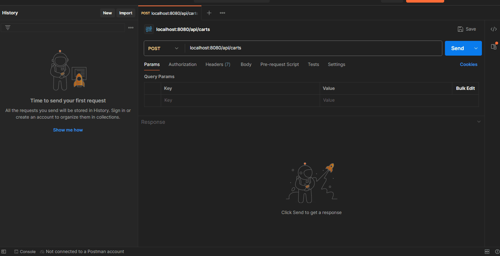

# Aplicación Backend E-Commerce **CoderHouse** - **comision:70065**

# ACTIVIDAD PRIMERA PRE-ENTREGA

La misma hace referencia a un proyecto que es una API de backend desarrollada con Node.js y Express que permite gestionar productos y carritos de compras. La información se persiste en archivos JSON.

## Tabla de Contenidos
1. [Instalación](#instalación)
2. [Configuración](#configuración)
3. [Uso](#uso)
4. [Estructura del Proyecto](#estructura-del-proyecto)
5. [Contribuir](#contribuir)
6. [Autor](#Autor)

## Instalación

### Requisitos previos
- Node.js v14.17.0
- Docker v20.10.7

### Instrucciones de instalación
1. Clonar el repositorio:
   ```sh
   git clone https://github.com/usuario/proyecto.git

## Configuración

### Variables de entorno

`PORT`: El puerto en el que la aplicación se ejecutará (por defecto: 8080).\
`DB_URI`: URI de conexión a la base de datos.

# Uso

## Endpoints de la API

Listar todos los productos

**GET** `/api/products`: Obtiene la lista de productos.\

Obtener un producto por ID

**GET** `/api/products/:pid`: Obtiene la lista de productos por el id ingresado.\


Crear un nuevo producto

**POST** `/api/products`: Crea un nuevo producto.

Body:

{
  "title": "Producto 1",
  "description": "Descripción del producto 1",
  "code": "P001",
  "price": 100,
  "stock": 10,
  "category": "Categoría 1",
  "thumbnails": ["url1", "url2"]
}

Actualizar un producto

**PUT** `/api/products/:pid`: actualiza el producto.

Body: (Campos a actualizar):

Eliminar un producto

**DELETE** `/api/products/:pid`: elimina el producto.

Carritos

Crear un nuevo carrito

**POST** `/api/carts`: Crea un nuevo carrito.

Obtener un carrito por ID

**GET** `/api/carts/:cid`: obtiene el carrito especificando el ID del mismo.

Agregar un producto al carrito

**POST** `/api/carts/:cid/product/:pid`: agrega un producto especifico al carrito en funcion del ID.

En los siguientes archivos Gif, podemos ver la funcionalidad antes explicada verificando mediante Postman

Productos y funcionalidades:


Carrito y funcionalidades:




# Estructura del proyecto
````
mi proyecto/MI API
├── src/
│   ├── routes/
│   │     ├── Carts.js
│   │     └── Products.js
│   ├── data/
│   │     ├── carts.json
│   │     └── products.json
│   └── app.js
├── assets/
│     ├── carts.json
│     └── products.json
├── node_modules/
├── package-lock.json/
├── package.json/
└── README.md

````
## Contribuir

Si deseas contribuir a este proyecto, por favor sigue estos pasos:

Haz un fork del repositorio.

Crea una nueva rama (git checkout -b feature/nueva-funcionalidad).
Realiza los cambios y haz commit (git commit -am 'Agrega nueva funcionalidad').

Sube los cambios a tu rama (git push origin feature/nueva-funcionalidad).

Abre un Pull Request.

# Autor

Ocampo Santiago - Desarrollador principal